<!-- START doctoc generated TOC please keep comment here to allow auto update -->
<!-- DON'T EDIT THIS SECTION, INSTEAD RE-RUN doctoc TO UPDATE -->
**Table of Contents**  *generated with [DocToc](https://github.com/thlorenz/doctoc)*

- [image-processor](#image-processor)
  - [Licencia](#licencia)
  - [Caracteristicas ¿Qué te ofrece data-auditor?](#caracteristicas-%C2%BFqu%C3%A9-te-ofrece-data-auditor)
  - [Planning, Requirements Engineering and risk management / Planeacion, Ingenieria de Requerimientos y gestion del riesgo](#planning-requirements-engineering-and-risk-management--planeacion-ingenieria-de-requerimientos-y-gestion-del-riesgo)
  - [Documentacion](#documentacion)
    - [Convenciones usadas durante la docuemntacion](#convenciones-usadas-durante-la-docuemntacion)
    - [Uso](#uso)
      - [Requisitos](#requisitos)
        - [Instalacion](#instalacion)
          - [Como usuario](#como-usuario)
          - [Como biblioteca (Solo si quieres crear un programa que use la libreria)](#como-biblioteca-solo-si-quieres-crear-un-programa-que-use-la-libreria)
        - [Archivo .env (esto es necesario cuando se quiere generar un esquema a partir de ña base de datos el comportamiento por defecto)](#archivo-env-esto-es-necesario-cuando-se-quiere-generar-un-esquema-a-partir-de-%C3%B1a-base-de-datos-el-comportamiento-por-defecto)
      - [Uso desde la interfaz de linea de comandos](#uso-desde-la-interfaz-de-linea-de-comandos)
        - [Analisis de directorios](#analisis-de-directorios)
        - [Generar versiones de imagenes](#generar-versiones-de-imagenes)
    - [Make a donation. Your contribution will make a difference.](#make-a-donation-your-contribution-will-make-a-difference)
    - [Find me on:](#find-me-on)

<!-- END doctoc generated TOC please keep comment here to allow auto update -->


# image-processor

[Readme version in English](./README-EN.md)

image-processor` es una libreria y una herramienta de línea de comandos (CLI) diseñada para generar versiones responsivas de tus imágenes de manera rápida y sencilla. Convierte imágenes individuales o directorios completos para optimizar tus diseños web. ¡Comienza a crear imágenes responsivas hoy mismo!


## Licencia

Este código tiene licencia bajo la licencia pública general de GNU versión 3.0 o posterior (LGPLV3+). Puede encontrar una copia completa de la licencia en https://www.gnu.org/licenses/lgpl-3.0-standalone.htmlalone.html0-standalone.html

## Caracteristicas ¿Qué te ofrece data-auditor?

CLI para crear versiones responsivas de tus images o convertir un directorio completo 

Convierte un directorio completo en un directorio de imagenes responsivas, siguiendo nuestro estandar o utilizando la version que consideres mejor

Genera versiones responsivas de tus imagenes siguiendo nuestro estandar o escogiendo tus propios tamaños

## Planning, Requirements Engineering and risk management / Planeacion, Ingenieria de Requerimientos y gestion del riesgo

Estas secciones del proyecto se llevara por medio de un sitio en notion de forma que puedan ser facilmente accesibles por el personal no tecnico.

Solicita el link de acceso al personal autorizado

<!-- ## Software Design / Diseño de Software

### Perspectiva Estructural

#### Vista Logica de la Arquitectura del software  -->
<!-- 
En el siguiente diagrama de clases se veran las abstracciones clave en el sistema, sus interaciones  responsabilidades.

``` mermaid
---
title: database auditor
---
classDiagram
    
    class DatabaseAuditor{
    
    }

    note for DatabaseAuditor "Busca ser el contexto para las distintas estrategias usadas
    y un medio que encapsula funciones utilitarias 
    comunes para todos los algoritmos"

    DatabaseAuditor ..> DatabaseSchemaGenerator

    class DatabaseSchemaGenerator{
        <<Abstract>>
        +databaseAuditor
        +generate()
    }

    note for DatabaseSchemaGenerator "Proporciona la interfaz estrategia 
    que es común a todas las estrategias concretas 
    para la generacion de los 
    esquemas de la base de datos"

    DatabaseSchemaGenerator ..> SchemaFromDBUsingName
    DatabaseSchemaGenerator ..> SchemaFromJSON

    class SchemaFromJSON{
        +databaseAuditor
        +generate()
    }

    class SchemaFromDBUsingName{
        +databaseAuditor
        +generate()
    }

    note for SchemaFromDBUsingName "Es una de las estrategias concretas 
    que genera los esquemas por medio de los nombres
     de las convenciones de nombres de la base de datos"

    DatabaseAuditor ..> ValidationAlgorithm

    note for ValidationAlgorithm "Proporciona la interfaz estrategia 
    que es común a todas las estrategias concretas 
    para la generacion de las 
    validaciones de la base de datos"

    class ValidationAlgorithm{
        <<Abstract>>
        +execute()
    }

    ValidationAlgorithm <|-- NonAdditiveConcatenation
    ValidationAlgorithm <|-- VerificationBCNF


    class VerificationNonAdditiveConcatenation{
        +databaseAuditor
        +execute()
    }


    note for NonAdditiveConcatenation "Encapsula el Algoritmo 11.1 de Verificación 
de la propiedad de concatenación no aditiva propuesto por RAMEZ ELMASRI 
y SHAMKANT B. NAVATHE"

    class VerificationBCNF{
        +databaseAuditor
        +execute()
    }

    note for NonAdditiveConcatenation "Encapsula el Algoritmo que valida que cada 
    descomposicion posea la BCNF 
    en base a la definicion presentada 
    por RAMEZ ELMASRI y SHAMKANT B. NAVATHE"

    DatabaseAuditor <.. Client

    class Client{

    }

``` -->

<!-- ### Perspectiva de comportamiento

#### SchemaFromDatabaseUsingName.generateJoinsClusters process / Proceso de SchemaFromDatabaseUsingName.generateJoinsClusters -->



## Documentacion
El image-processor te permite generar distintas versiones de tus imagenes

### Convenciones usadas durante la docuemntacion
Convenciones de notacion para la gramatica:

Los <> se utilizan para rodear un simbolo no terminal

El ::= se utiliza para reglas de produccion

Los simbolos no terminales se expresan como una cadena o caracteres normales

El siguiente grupo de pares de simbolos, se deben utilizar junto a las expresiones de la siguiente forma: el primero en cada pareja se escribe como sufijo despues de la expresion y el segundo rodea la expresion. 

El ? o [] indican que la expresion es opcional

El * o {} indica que la expresion se repite 0 o mas veces

El + indica que la expresion se repite 1 o mas veces

Si se quiere usar uno de los caracteres anteriores se debe de anteceder \ con 

### Uso

#### Requisitos 

##### Instalacion 

###### Como usuario

composer install israeldavidvm/image-processor

composer global require israeldavidvm/image-processor

composer require israeldavidvm/image-processor


###### Como biblioteca (Solo si quieres crear un programa que use la libreria)
composer require israeldavidvm/image-processor

##### Archivo .env (esto es necesario cuando se quiere generar un esquema a partir de ña base de datos el comportamiento por defecto)

Establece una configuracion en el archivo .env. como la siguiente

```




API_KEY_TINYPNG=<APIKEY>


```

#### Uso desde la interfaz de linea de comandos 

Para poder usar el programa solo necesitaras un archivo .env con la configuracion como se especifico anteriormente y ejecutar el comando

##### Analisis de directorios

**Si es incluido en un proyecto por medio de require con el global (composer global require israeldavidvm/image-processor)**

```~/.config/composer/vendor/bin/image-processor  make-ri-repository <pathToDir> [<sizes> [<pathToEnvWithKey>]]```

**Si es incluido en un proyecto por medio de require sin el global (composer require israeldavidvm/image-processor)**

```./vendor/bin/image-processor  make-ri-repository <pathToDir> [<sizes> [<pathToEnvWithKey>]]```

Description:
  Este comando te permite analizar un directorio y generar una serie de variaciones para cada imagen de acuerdo a medidas comunes en el diseño web responsivo rwd o las que les pases como parametro

Usage:
  make-ri-repository <pathToDir> [<sizes> [<pathToEnvWithKey>]]

Arguments:
  pathToDir             Especifica la ruta al archivo directorio base
  sizes                 Cadena que especifica los distintos tamaños maximos horizontales en pixeles separados por coma, por ejemplo 360,720,1080,1440,1800,2160,2880,3600,4320
  pathToEnvWithKey      Especifica la ruta al archivo .env que contiene la clave de la API de TinyPNG [default: "./.env"]

Options:
  -h, --help            Display help for the given command. When no command is given display help for the list command
      --silent          Do not output any message
  -q, --quiet           Only errors are displayed. All other output is suppressed
  -V, --version         Display this application version
      --ansi|--no-ansi  Force (or disable --no-ansi) ANSI output
  -n, --no-interaction  Do not ask any interactive question
  -v|vv|vvv, --verbose  Increase the verbosity of messages: 1 for normal output, 2 for more verbose output and 3 for debug

##### Generar versiones de imagenes


**Si es incluido en un proyecto por medio de require con el global (composer global require israeldavidvm/image-processor)**

```~/.config/composer/vendor/bin/image-processor  generate-responsive-images <pathToImage> [<sizes> [<pathToEnvWithKey>]]```

**Si es incluido en un proyecto por medio de require sin el global (composer require israeldavidvm/image-processor)**

```./vendor/bin/image-processor  generate-responsive-images <pathToImage> [<sizes> [<pathToEnvWithKey>]]```

Description:
  Este comando te permite generar una serie de variaciones de una imagen de acuerdo a medidas comunes en el diseño web responsivo rwd o las que les pases como parametro para una imagen en particular

Usage:
  generate-responsive-images <pathToImage> [<sizes> [<pathToEnvWithKey>]]

Arguments:
  pathToImage           Especifica la ruta al archivo de imagen del que se quieren generar las versiones responsivas
  sizes                 Cadena que especifica los distintos tamaños maximos horizontales en pixeles separados por coma, por ejemplo 360,720,1080,1440,1800,2160,2880,3600,4320
  pathToEnvWithKey      Especifica la ruta al archivo .env que contiene la clave de la API de TinyPNG [default: "./.env"]

Options:
  -h, --help            Display help for the given command. When no command is given display help for the list command
      --silent          Do not output any message
  -q, --quiet           Only errors are displayed. All other output is suppressed
  -V, --version         Display this application version
      --ansi|--no-ansi  Force (or disable --no-ansi) ANSI output
  -n, --no-interaction  Do not ask any interactive question
  -v|vv|vvv, --verbose  Increase the verbosity of messages: 1 for normal output, 2 for more verbose output and 3 for debug

### Make a donation. Your contribution will make a difference.
[](https://ko-fi.com/israeldavidvm)
[](https://paypal.me/israeldavidvm)
[](https://www.binance.com/activity/referral-entry/CPA?ref=CPA_004ZGH9EIS)

### Find me on:
[](https://github.com/israeldavidvm)
[](https://www.linkedin.com/in/israeldavidvm/)
[](https://twitter.com/israeldavidvm)
[](https://www.facebook.com/israeldavidvm)
[](https://www.instagram.com/israeldavidvm/)
[](https://www.tiktok.com/@israeldavidvm)
[](https://www.youtube.com/channel/UCmZLFpEPNdwpJOhal0wry7A)

